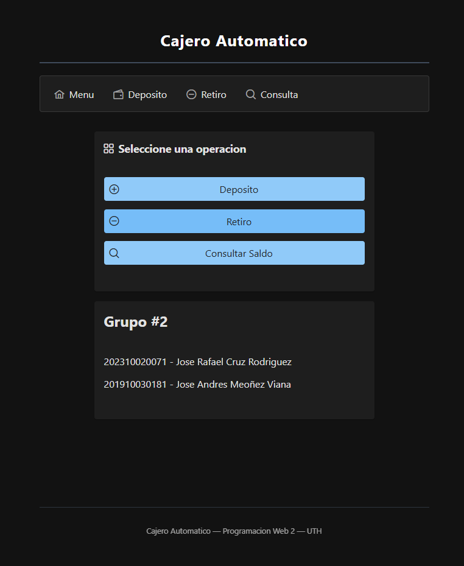
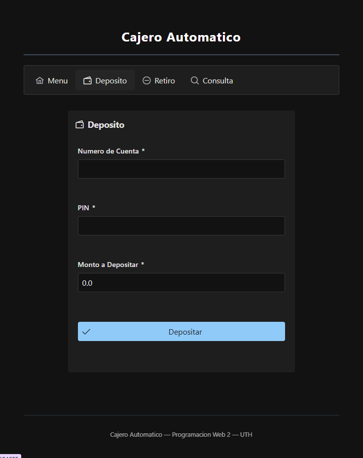
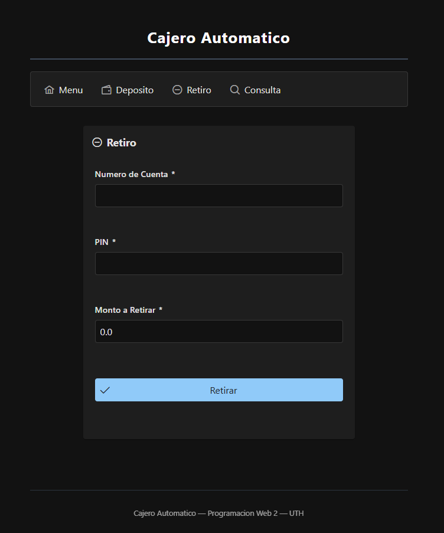
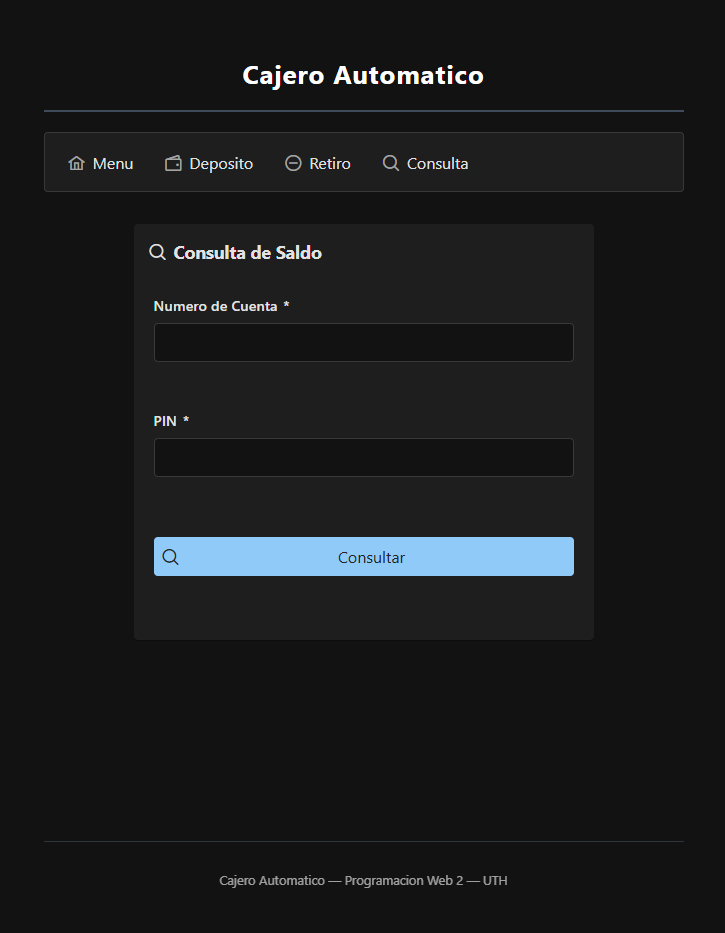

> **Nota Importante sobre Configuración:**  
> En un momento se tuvo errores para correr el repositorio, la solución fue agregar manualmente el Tomcat siguiendo estos pasos:

1. Ir a **Run** → **Edit Configurations**
2. Seleccionar **Tomcat Server** → **Deployment**
3. Presionar **+** → **Artifact** → **CajeroAutomatico:war**
4. Click en **Apply** → **OK**
---
**Ruta de CSV:** CajeroAutomatico\src\main\resources\clientes.csv

# Funcionalidad del Cajero Automático

La aplicación simula las operaciones básicas de un cajero automático permitiendo a los usuarios realizar depósitos, retiros y consultas de saldo mediante un número de cuenta y un PIN.

*Figura 1: Interfaz principal de la aplicación*

## Operaciones

### Depósito

El usuario debe ingresar:
- Número de cuenta
- PIN
- Monto a depositar

Si los datos son correctos, el sistema agrega el monto al saldo de la cuenta y muestra el nuevo saldo.

*Figura 2: Pantalla de depósito*

### Retiro

El usuario debe ingresar:
- Número de cuenta
- PIN
- Monto a retirar

El sistema valida:
- Que el PIN sea correcto
- Que el saldo sea suficiente

Si todo es válido, el sistema descuenta el monto del saldo disponible.

*Figura 3: Pantalla de retiro*

### Consulta de Saldo

El usuario ingresa:
- Número de cuenta
- PIN

Si la información es correcta, el sistema muestra el saldo actual de la cuenta.

*Figura 4: Pantalla de consulta de saldo*

## Validaciones del Sistema

- **PIN inválido:** cuando el PIN no coincide con la cuenta.
- **Saldo insuficiente:** cuando el retiro es mayor al saldo disponible.
- **Monto inválido:** cuando el monto ingresado es menor o igual a cero.
- **Operación exitosa:** cuando la transacción se realiza correctamente.

## Cuentas de Prueba

| Cuenta | PIN  | Saldo Inicial   |
| :---   | :--- | :---            |
| 1001   | 1234 | L. 5,000.00     |
| 1002   | 5678 | L. 12,000.50    |
| 1003   | 9012 | L. 800.00       |
| 1004   | 3456 | L. 25,000.75    |
| 1005   | 7890 | L. 150.00       |

---
**Jose Rafael Cruz Rodriguez – 202310020071**

**Jose Andres Meoñez Viana   – 201910030181**